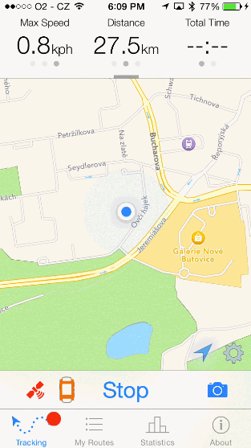

## GSTouchesShowingWindow

A simple tool that automatically shows all touches inside your app as they are happening, using a circular image indicator. It's useful for creating iOS 8 App Previews, or any kind of app videos where you need to demonstrate some rich user interaction that might be hard to explain otherwise.

### Example


### How to set it up

1. First, copy `GSTouchesShowingWindow.h`, `GSTouchesShowingWindow.m` and the `GSTouchImage@2x.png` to your project.
2. Now, if you are using Storyboard: <br>
In your `AppDelegate.m`, import the header:
```
#import “GSTouchesShowingWindow.h”
```
and add the following `-window` method. This will provide the app with our own window instance instead of the default UIWindow.
```
- (GSTouchesShowingWindow *)window {
    static GSTouchesShowingWindow *window = nil;
    if (!window) {
        window = [[GSTouchesShowingWindow alloc] initWithFrame:[[UIScreen mainScreen] bounds]];
    }
    return window;
}
```
If you are still using plain old .xib files, you just need to open `MainWindow.xib`, select the window and then change the class in Identity Inspector from UIWindow to `GSTouchesShowingWindow`.

3) That’s it! There is no step three.

### How it actually works

Inside the UIWindow subclass, I am just overriding the `-sendEvent` method, processing all the events and adding/moving/removing imageViews based on those events' touches. And then I call `[super sendEvent];` so that the touches are forwarded to the app.

If you have any questions, you can contact me on Twitter <a href="http://twitter.com/luksape target="_blank">@luksape</a>.

