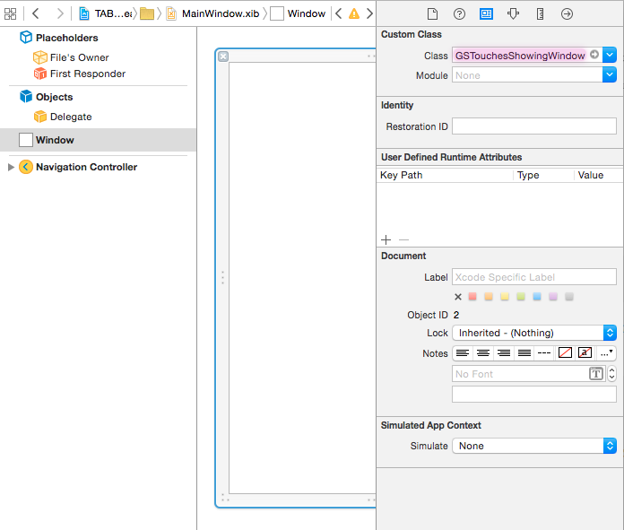

## GSTouchesShowingWindow

A simple tool that automatically shows all touches inside your app as they are happening, using a circular image indicator. It's useful for creating iOS 8 **App Previews**, or any kind of **app videos** where you need to demonstrate some rich user interaction that might be hard to explain otherwise.

### Example


Short interaction in [Timelines](http://timelinesapp.io), my app for tracking time.

### Installation

GSTouchesShowingWindow is available through [CocoaPods](http://cocoapods.org). To install it, simply add the following line to your Podfile:

```ruby
pod 'GSTouchesShowingWindow'
```

Alternatively, you can just drag the contents of `GSTouchesShowingWindow/Classes` and `GSTouchesShowingWindow/Assets` into your project.

### How to set it up

A) Now, if you **are using Storyboard** in your project (and you should), do the following. **If you are not using Storyboard**, take a look at option B below.<br>
In your `AppDelegate.m`, import the header:
```
#import “GSTouchesShowingWindow.h”
```
and add the following `-window` method. This will provide the app with our own window instance instead of the default UIWindow.
```Objective-C
- (GSTouchesShowingWindow *)window {
    static GSTouchesShowingWindow *window = nil;
    if (!window) {
        window = [[GSTouchesShowingWindow alloc] initWithFrame:[[UIScreen mainScreen] bounds]];
    }
    return window;
}
```
B) **If you are still using plain old .xib files**, you only need to open your `MainWindow.xib`, select the window and then change the class in Identity Inspector from UIWindow to `GSTouchesShowingWindow`. Like this:


### How it actually works

Inside the UIWindow subclass, I am just overriding the `-sendEvent` method, processing all the events and adding/moving/removing imageViews based on those events' touches. And then I call `[super sendEvent];` so that the touches are forwarded to the app.

If you have any questions, you can contact me on Twitter [@luksape](http://twitter.com/luksape).

